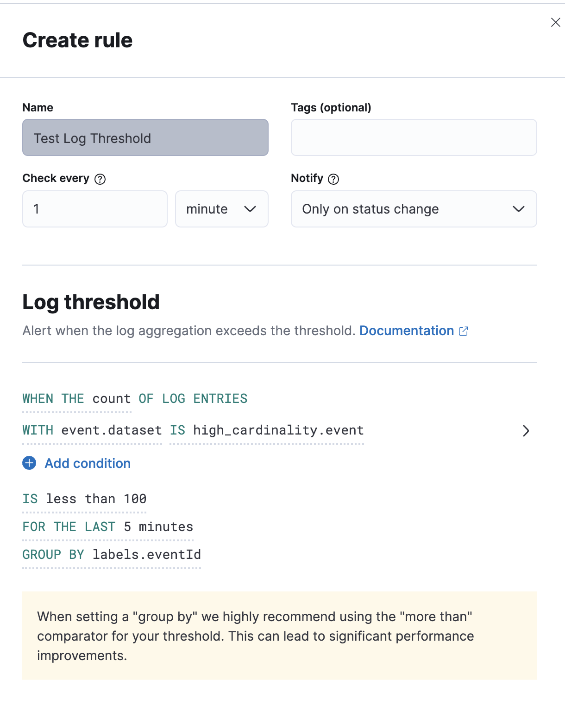
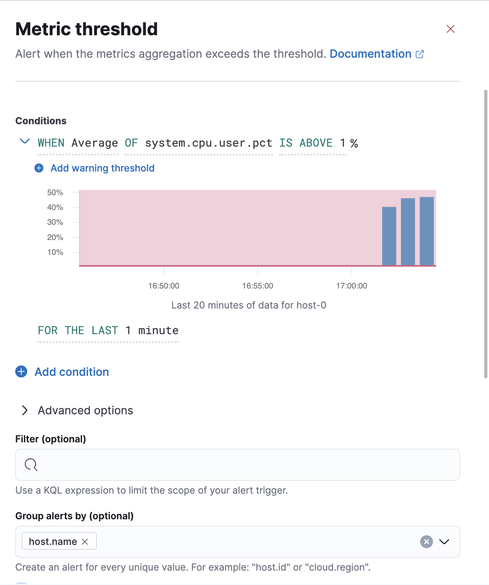

## Notes from Meeting with Chris Cowan from Observability
The metric threshold rule has been super optimized and no longer presents a performance problem, so we will have to either artificially slow it down again for our purposes or use log thresholds to test.

Chris also mentioned that in addition to the query and post-processing, [this call](https://github.com/elastic/kibana/blob/ba6be14baa6db9f9716c8746b2c355aa7031d104/x-pack/plugins/infra/server/lib/alerting/metric_threshold/metric_threshold_executor.ts#L58) to actually create the executor also performs some work. It wouldn't hurt to have this happen in the worker as well.

## Load Testing Alerts
### Configure logging event loop performance metrics

Set the following configuration values:
```yml
logging:
  appenders:
    metrics-file:
      type: file
      fileName: ./metrics.log
      layout:
        type: json
  loggers:
  - name: metrics.ops
    appenders: [metrics-file]
    level: debug
```

This will send monitoring data about the event loop delay histogram and event loop utilization to the `metrics.json` file. To view the contents of the file you could use:

```sh
tail -f ./metrics.json | jq
```

### Setup
- Start Elasticsearch via `yarn es snapshot --license=trial`
- Start Kibana vi `yarn start`
- Clone https://github.com/elastic/high-cardinality-cluster
- Run `cd high_cardinality_cluster/high_cardinality_indexer`

### Log Thresholds
- Start indexing high-cardinality logs via the following command. `EVENTS_PER_CYCLE` can be increased to create even more alerts. @simianhacker even suggested setting it to 100,000 for a real stress test.
```
DATASET="fake_logs" EVENTS_PER_CYCLE=10000 INDEX_INTERVAL=10000 ELASTICSEARCH_HOSTS=http://localhost:9200 node src/run.js
``` 
- Open Kibana -> Obervability -> Logs. You should see lots of logs, all with `event.dataset === 'high_cardinality.event'`
- Click "Alerts and rules" -> "Create rule"
- Set it up like so. If you've done it right, you'll get a yellow warning in the UI about perfomance (seen in the screenshot below).

- Click "Save"
- Visit "Observability" -> "Alerts" and watch them roll in ✅


### Metric Thresholds
**NOTE:** the metric thresholds rule almost certainly won't produce the load we're looking for due to @simianhacker's [recent optimizations](https://github.com/elastic/kibana/pull/121904).
- Start indexing high-cardinality logs via the following command. `EVENTS_PER_CYCLE` can be increased to create even more load.
```
DATASET="fake_hosts" EVENTS_PER_CYCLE=10000 INDEX_INTERVAL=10000 ELASTICSEARCH_HOSTS=http://localhost:9200 node src/run.js
``` 
- Visit "Stack Management" -> "Rulse and Connectors"
- Click "Create rule"
- Set the Metric threshold rule up like so.

- Click "Save"